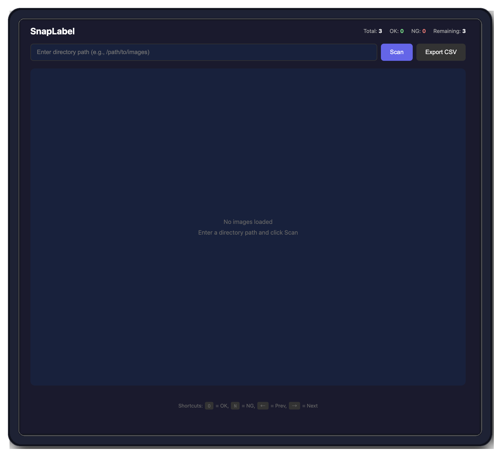

# SnapLabel

軽量・高速な画像ラベリングツール
<p align="center">

</p>


## 機能

- ディレクトリ内の画像（jpg/png）を順番に表示
- OK/NGボタンまたはキーボードでラベル付け
- 前の画像に戻って修正可能
- CSVエクスポート
- 進捗状況の表示

## 起動方法

```bash
# リポジトリをクローン後、ディレクトリに移動
cd claude_test

# 画像を入れるディレクトリを作成
mkdir -p data

# 起動
docker-compose up --build
```

ブラウザで http://localhost:8000 にアクセス

## ディレクトリ構成

```
claude_test/
├── main.py              # FastAPIアプリケーション
├── database.py          # DB操作
├── requirements.txt     # 依存パッケージ
├── Dockerfile
├── docker-compose.yml
├── templates/
│   └── index.html       # フロントエンド
├── static/
│   └── style.css        # スタイル
├── data/                # 画像を配置するディレクトリ
│   └── (your images)
└── db/                  # SQLiteデータベース（自動生成）
    └── labels.db
```

## 使い方

1. ラベル付けしたい画像を `data/` ディレクトリに配置
2. ブラウザで `/data` と入力して「Scan」をクリック
3. OK/NGボタンでラベル付け（自動で次へ進む）
4. 完了したら「Export CSV」でダウンロード

## キーボードショートカット

| キー | 動作 |
|------|------|
| `O` | OK |
| `N` | NG |
| `←` | 前の画像 |
| `→` | 次の画像 |

## API

| Method | Endpoint | 説明 |
|--------|----------|------|
| POST | /scan | ディレクトリをスキャン |
| GET | /images/current | 現在の画像を取得 |
| GET | /images/next | 次の画像へ |
| GET | /images/prev | 前の画像へ |
| POST | /images/{id}/label | ラベルを保存 |
| GET | /stats | 進捗状況を取得 |
| GET | /export/csv | CSVエクスポート |

## 停止

```bash
docker-compose down
```

## 技術スタック

- Python 3.11
- FastAPI
- SQLite (aiosqlite)
- Vanilla JavaScript
