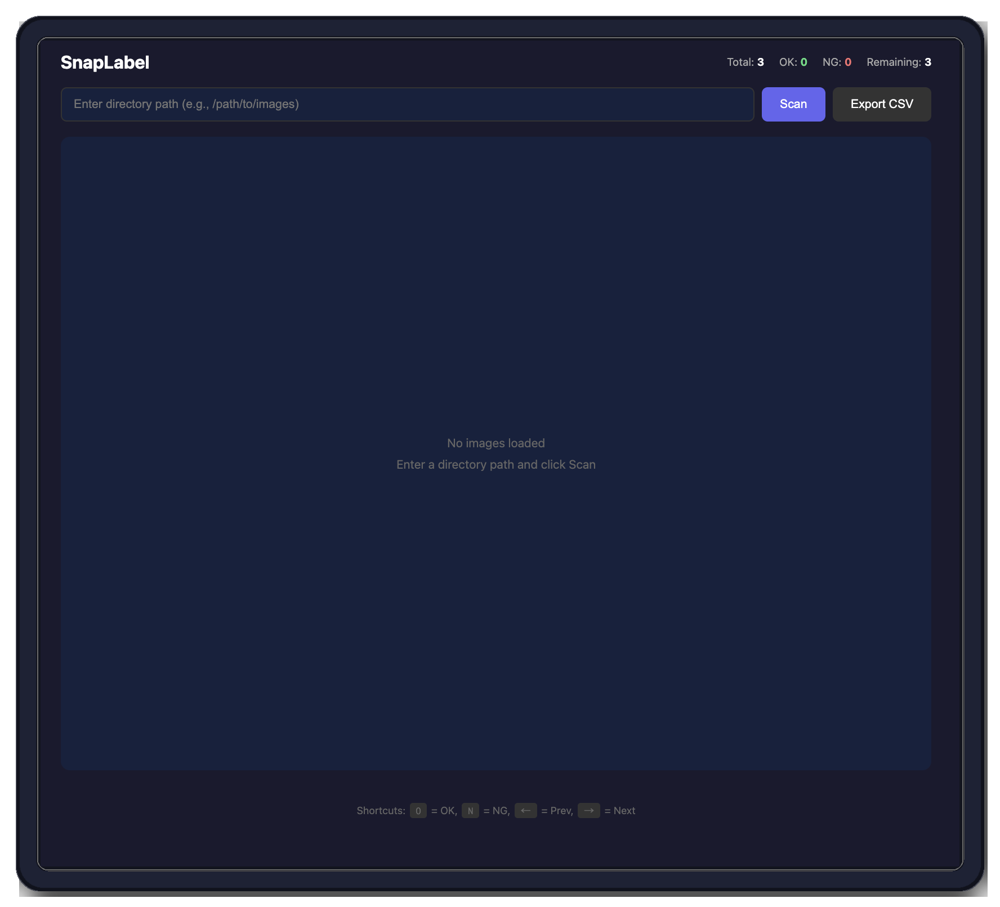

<p align="center">
  
</p>

<p align="center">
  <strong>軽量・高速な画像ラベリングツール</strong>
</p>

<p align="center">
  <a href="#機能">機能</a> •
  <a href="#起動方法">起動方法</a> •
  <a href="#使い方">使い方</a> •
  <a href="#キーボードショートカット">ショートカット</a> •
  <a href="#api">API</a>
</p>

---

<p align="center">
  
</p>

## 機能

| 機能 | 説明 |
|------|------|
| 画像表示 | ディレクトリ内の画像（jpg/png）を順番に表示 |
| ラベル付け | OK/NGボタンまたはキーボードで素早くラベル付け（ラベル後に自動で次へ進む） |
| 履歴保持 | 再スキャン時もラベル済み画像の情報を維持 |
| 全画像ナビゲーション | ラベル済み・未ラベルを問わず全画像を前後に移動・確認可能 |
| 修正機能 | 前の画像に戻り OK/NG を押し直すだけでラベルを上書き修正 |
| 拡大表示 | 画像クリックでモーダル表示（最大画面サイズ） |
| エクスポート | CSVで結果をダウンロード |
| 進捗表示 | 総数・OK数・NG数・残数をリアルタイム表示 |

## 起動方法

```bash
# リポジトリをクローン
git clone https://github.com/hisashi-ito/SnapLabel.git
cd SnapLabel

# 画像を入れるディレクトリを作成
mkdir -p data

# 起動
docker-compose up --build
```

ブラウザで http://localhost:8000 にアクセス

## 使い方

1. ラベル付けしたい画像を `data/` ディレクトリに配置
2. ブラウザで `/data` と入力して「Scan」をクリック
3. OK/NGボタンでラベル付け（自動で次へ進む）
4. 完了したら「Export CSV」でダウンロード

### 作業の再開

作業履歴はデータベースに保存されます。同じディレクトリを再スキャンすると：
- ラベル済み画像はラベルバッジ付きで表示され、前後に自由に移動して修正可能
- 新しく追加された画像も自動で検出

## キーボードショートカット

| キー | 動作 |
|:----:|------|
| `O` | OK |
| `N` | NG |
| `←` | 前の画像 |
| `→` | 次の画像 |
| `Esc` | 拡大表示を閉じる |

## API

| Method | Endpoint | 説明 |
|--------|----------|------|
| POST | `/scan` | ディレクトリをスキャン |
| GET | `/images/current` | 現在の画像を取得 |
| GET | `/images/next` | 次の画像へ |
| GET | `/images/prev` | 前の画像へ |
| GET | `/images/peek_next` | インデックスを変えずに次の画像情報を取得 |
| POST | `/images/{id}/label` | ラベルを保存（上書き可） |
| GET | `/images/{id}/file` | 画像ファイルを配信 |
| GET | `/stats` | 進捗状況を取得 |
| GET | `/export/csv` | CSVエクスポート |

## ディレクトリ構成

```
SnapLabel/
├── main.py              # FastAPIアプリケーション
├── database.py          # DB操作
├── requirements.txt     # 依存パッケージ
├── Dockerfile
├── docker-compose.yml
├── pytest.ini           # テスト設定
├── templates/
│   └── index.html       # フロントエンド
├── static/
│   └── style.css        # スタイル
├── tests/               # テストコード
│   ├── conftest.py
│   ├── test_api.py
│   └── test_database.py
├── data/                # 画像を配置するディレクトリ
└── db/                  # SQLiteデータベース（自動生成）
```

## 停止

```bash
docker-compose down
```

## 技術スタック

<p>
  
  
  
  
</p>

## License

MIT License
